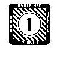
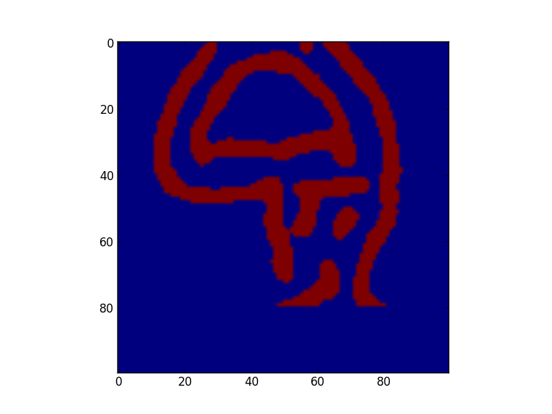
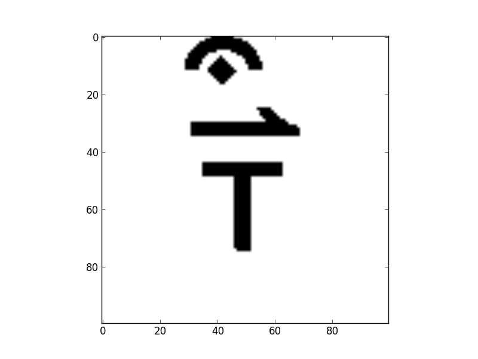
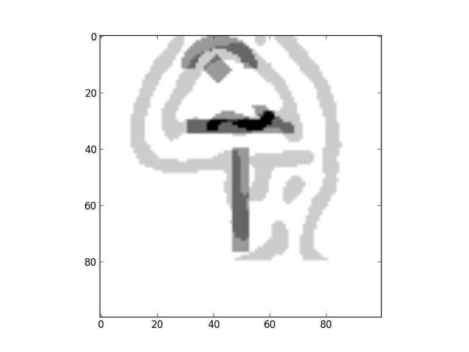

Find your lucky unicodes!
===
Search for the combination of unicode characters that "best" matches a gravatar.

The repo includes ```chars.tar.gz```, containing some 2000 GIF renderings of unicode
characters.  They were originally ripped from ```fileformat.info``` and converted using
ImageMagick:

~~~.bash
for x  (a b c d e f g h i j k l m n o p q r s t u v w x y z); do 
   wget -r -l 1 -p http://www.fileformat.info/info/unicode/char/${x}.htm
done

# Convert to GIFs, since scipy gets confused by transparent PNGs:
perl -e 'for (@ARGV) {/([\dabcdef]+)\/(\w+\.png)/ && print "convert $_ chars/$1.gif\n";}' www.fileformat.info/info/unicode/char/*/*.png | sh

# Remove duds
rm `sum chars/* | grep 35064 | awk '{print $3}'`
rm `sum chars/* | grep 49947 | awk '{print $3}'`
rm `sum chars/* | grep "^4772" | awk '{print $3}'`
~~~

The "duds" above are things like , for which we don't have good renderings.

After much experimentation, the processing was reduced to the current contents of
```unicon.py```, the gist of which is that we look for similarity defined by Euclidean distance
in an orthogonal space obtained with SVD.

```get_gravatar_array``` Reads an icon from ```gravatar.com``` and by default will perform
edge detection on it, along with some clipping to remove gravatar's pretty frame, and then
flattens it into an array, e.g:

~~~.py
g  = get_gravatar_array("pnf@podsnap.com",sz=100,mask=((0,10),(80,90)),shrink=0.0,edge=(5,20,2,2))
imshow(g.reshape(100,100))
~~~


```get_unichars``` Reads in the GIFS as matrices, flattens them into arrays, stacks them
and performs an SVD, retaining by default dimensions 11-110.  The reason for ignoring
the first 10 is that they're not particularly interesting and in general encourage
space filling.
~~~.py
unis = get_unichars(100,100,snub=10)
(files,C,F,u,d,vh,ps) = unis
~~~
The ```ps``` above contains the projection of the characters in ```F``` onto ```u```.

At this point, finding the single best-matching unicode character requires only that
we project ```g``` onto ```u``` and look for the closest member of ```ps```, but a single
unicode character isn't very satisfying.  Instead, we try to find a combination of three
(or more) characters, which is an NP complete problem.  Accordingly, I attempt to
approximate the solution by simulated annealing.  I use a probability distribution
vaguely resembling Boltzmann: ```exp(d**2/T)```, where ```d``` is the distance in the
```u``` space and ```T``` is an essentially arbitrary pseudo-temperature that will get
decreased log-linearly, as we accept or reject substitutions of characters based on the
Metropolis-Hastings criterion.  This takes a while, but there's an option to provide
visual updates of the progressing solution.

~~~.py
ya = anneal(unis,g, 1.0e7,3,1000000,50000,1)
imshow(255-ya[0].reshape(100,100),cmap=cm.gray)
imshow(-(1.0*ya[0]+0.5*g).reshape(100,100),cmap=cm.gray)  # overlay
~~~



There are many potential improvements:
* Include processing options for the gravatar in the optimization.  The smoothing and
  edge detection parameters above seem to work decently for conventionally composed headshots,
  but can be easily thrown off by reasonable scale, position and contrast choices.
* Include shifted and possibly scaled characters.  This will make the SVD calculation
  take considerably longer.
* Do something worthwhile instead of this.


